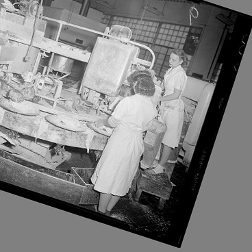

# Image Augmentation in OpenPose

## 1. Original

## 2. Scale image according to a bbox height

transformed_bbox.height = random_multiplier * 368 * 0.6

## 3. Rotate image

random rotate from -40 degrees to 40 degrees

## 4. Chrop image at the bbox center

resulted size = 368 * 368

